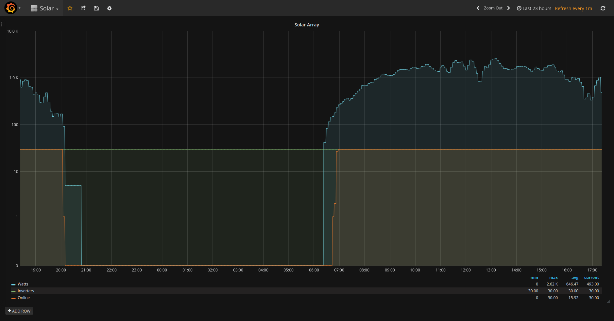

# enphase-envoy

A Lua script designed to scrape the System Statistics page published by [Envoy-C gateways](https://enphase.com/en-us/products-and-services/envoy/family) manufactured by [Enphase](https://enphase.com) in order to log the following data to [InfluxDB](https://www.influxdata.com/) for historical purposes:

* wattage/hour produced by the solar array
* number of inverters installed
* number of inverters online

The InfluxDB data can be visualized using a [Grafana](https://grafana.com/) dashboard.

This script can be useful for off-grid systems without Internet access or for system owners who do not want to report their production statistics to Enphase.

# Dependencies

* Enphase Envoy-C gateway
* cURL to query and post data
* Lua >= 5.2
* InfluxDB >= 1.2.0
* Grafana >= 4.2.0

# Setup

* Create a database named 'solar' in InfluxDB
* Edit the script and update the site, envoyGW and influxDB variables with appropriate settings for your installation.
* Schedule the execution of the script every minute with 'cron', for example:

```
*/1 * * * * /home/foo/enphase-envoy/envoy.lua
```

* In Grafana, create a datasource named 'solar' pointing to the 'solar' database in InfluxDB, then import 'solar-dashboard.json' as a new dashboard.


